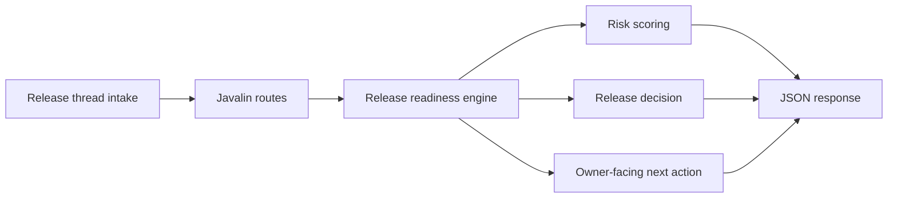

# Release Readiness Gatekeeper

Release Readiness Gatekeeper is a Kotlin and Javalin backend for turning launch pressure into explicit release decisions. It models freeze windows, dependency drag, rollback posture, and error-budget pressure so teams can decide whether to ship, watch, or hold without relying on vague release calls.

## Portfolio Takeaway

- Kotlin backend with release policy logic that feels operational, not academic
- launch, freeze, and rollback posture turned into concrete ship decisions
- simple JSON API with docs, tests, CI, and real PNG proof

## Overview

| Area | Details |
| --- | --- |
| Language | Kotlin 2.0 |
| Runtime | Java 21 |
| Server | Javalin |
| Focus | Release gate evaluation, dependency readiness, freeze-window pressure, rollback guidance |
| Routes | `/`, `/docs`, `/api/dashboard/summary`, `/api/releases`, `/api/releases/{id}`, `/api/sample`, `/api/analyze/release` |
| Validation | `./gradlew.bat test`, `./gradlew.bat build` |

## What It Does

- models release threads with severity, blocked dependencies, and rollback posture
- scores each payload into `stable`, `watch`, or `escalate`
- returns a release decision of `ship`, `conditional-ship`, or `hold`
- exposes a JSON API that can feed launch dashboards, runbooks, or internal review surfaces

## Architecture



Additional detail lives in [C:\Users\chaus\dev\repos\release-readiness-gatekeeper\docs\architecture.md](/C:/Users/chaus/dev/repos/release-readiness-gatekeeper/docs/architecture.md).

## API

### `GET /`
Returns service metadata and route discovery.

### `GET /docs`
Returns a lightweight HTML operator guide.

### `GET /api/dashboard/summary`
Returns queue posture and aggregate release pressure.

### `GET /api/releases`
Returns the modeled release threads.

### `GET /api/releases/{id}`
Returns a single release thread.

### `GET /api/sample`
Returns a sample release analysis.

### `POST /api/analyze/release`
Scores a payload and returns the recommended action.

Example payload:

```json
{
  "id": "rel-9502",
  "title": "Checkout patch is entering a freeze window with unresolved tax retries",
  "service": "checkout-runtime",
  "severity": "critical",
  "releaseWindowHours": 1.25,
  "errorBudgetRemaining": 0.16,
  "blockedDependencies": 3,
  "rollbackReady": false,
  "freezeWindowActive": true,
  "ownerLane": "platform-release",
  "blockers": [
    "Rollback artifact is not validated in-region",
    "Tax service retries are still above tolerance"
  ],
  "nextSteps": [
    "Assign a rollback owner",
    "Pause the release lane"
  ]
}
```

## Screenshots

### Hero


### Decision Lanes


### Escalation View


### Validation Proof


## Local Run

```powershell
Set-Location "C:\Users\chaus\dev\repos\release-readiness-gatekeeper"
$env:JAVA_HOME = "C:\Program Files\Microsoft\jdk-21.0.11.10-hotspot"
$env:Path = "$env:JAVA_HOME\bin;$env:Path"
.\gradlew.bat run
```

Then open:

- `http://127.0.0.1:4428/`
- `http://127.0.0.1:4428/docs`

If that port is already occupied, choose another one before running:

```powershell
$env:PORT = "4432"
.\gradlew.bat run
```

## Validation

```powershell
Set-Location "C:\Users\chaus\dev\repos\release-readiness-gatekeeper"
$env:JAVA_HOME = "C:\Program Files\Microsoft\jdk-21.0.11.10-hotspot"
$env:Path = "$env:JAVA_HOME\bin;$env:Path"
.\gradlew.bat test
.\gradlew.bat build
```

## Tech Stack

[](https://kotlinlang.org/)
[](https://javalin.io/)
[](https://gradle.org/)

## Portfolio Links

- [Kinetic Gain](https://kineticgain.com/)
- [LinkedIn](https://www.linkedin.com/in/mirzacausevic)
- [GitHub](https://github.com/mizcausevic-dev)
- [Skills Page](https://mizcausevic.com/skills/)
